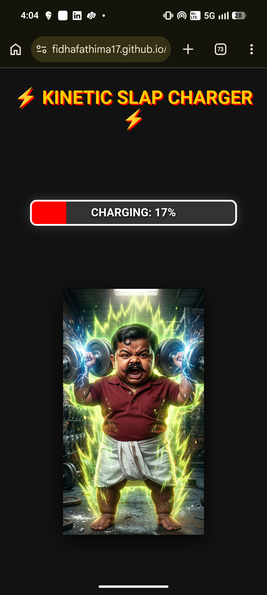
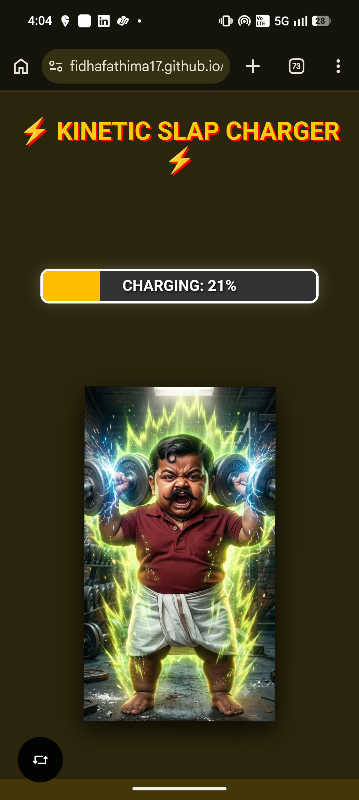
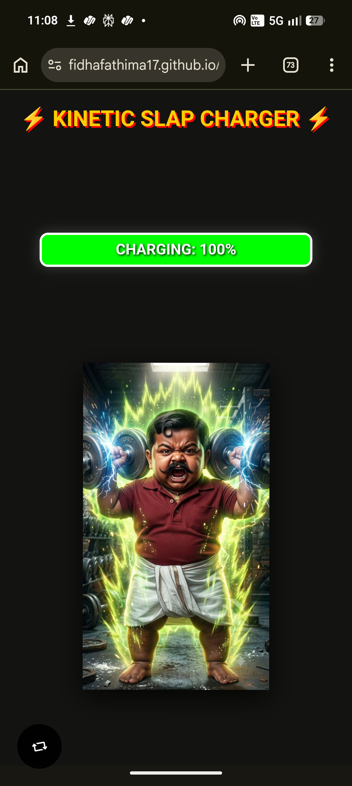
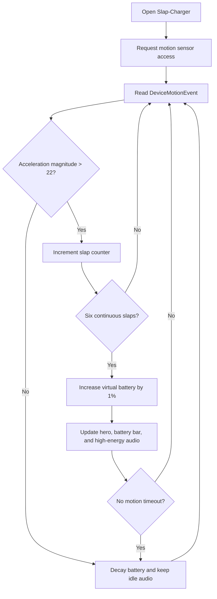

# Slap-Charger 🎯

## Basic Details

### Team Name: Zero & one

### Team Members

- Team Lead: Fidha Fathima - College of Engineering Trivandrum
- Member 2: Adhithyan K S - College of Engineering Trivandrum

### Project Description

Slap-Charger is an interactive, motion-triggered web application that turns phone shaking and slap gestures into a dynamic, gamified battery charging experience. Built with physical motion tracking and dynamic visual feedback, it simulates transferring kinetic energy directly into virtual mass power.

### The Problem (that doesn't exist)

In a world where phone batteries drain while sitting idle, people lack a high-energy, physical outlet to violently slap and shake their phones to pump kinetic energy back into their devices manually.

### The Solution (that nobody asked for)

A responsive Web App that captures 3D accelerometer data to track real-time shaking. Slapping your phone 6 times continuously charges your battery by 1% while unleashing high-energy character transformations and reactive continuous sound loops!

## Technical Details

### Technologies/Components Used

For Software:

- Languages used: HTML5, CSS3, JavaScript (ES6+)
- APIs used: Web Motion API (`DeviceMotionEvent`), HTML5 Media API (`Audio`)
- Tools used: VS Code, Netlify, Git, GitHub

For Hardware:

- Smartphone with motion sensors

### Implementation

For Software:

# Installation

```bash
# Clone the repository
git clone https://github.com/fidhafathima17/slap-charger.git

# Navigate to project folder
cd slap-charger
```

# Run

```bash
# Open index.html directly in a mobile browser or run via local web server (e.g. Live Server in VS Code)
npx serve .
```

### Project Documentation

For Software:

# Screenshots








# Diagrams


_Workflow showing device accelerometer motion detection (`√(x²+y²+z²) > 22`) triggering slap counters, dual audio toggles, and state decay timers._

### Project Demo

<!-- # Video -->

<!-- [Add your demo video link here] -->

# Additional Demos

Live demo: https://fidhafathima17.github.io/slap-charger/

## Team Contributions

- Fidha Fathima: Developed motion sensor detection logic (`DeviceMotionEvent`), battery charging/discharge algorithms, continuous audio loop switching, and UI layout structure.
- Adhithyan K S: Designed visual assets (`hero_weak.png`, `hero_max.png`), CSS transition effects, sound file integration (`high.mp4`, `low.mp4`), documentation and GitHub pages  deployment setup.

Made with ❤️ at TinkerHub Useless Projects


